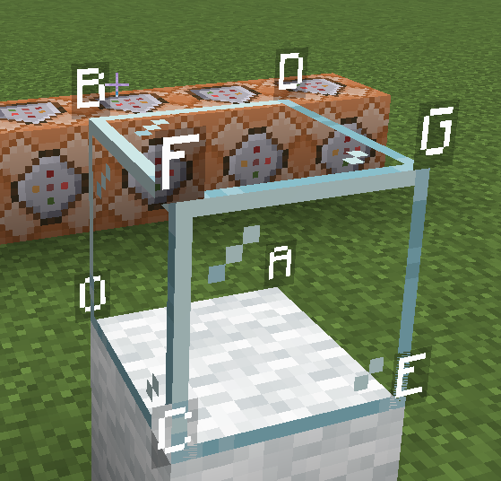

# 方块展示实体(Blcok display)

>最后更新：2025-06-06 01:24

## nbt属性

- block_state
- transformation
  - scale

## transformation

使用矩阵形式，我们可以使用16个浮点数表示渲染的变换
其基础状态如下
$$
\begin{bmatrix}
1 & 0 & 0 & 0 \\
0 & 1 & 0 & 0 \\
0 & 0 & 1 & 0 \\
0 & 0 & 0 & 1 \\
\end{bmatrix}
$$
设定其从左上到右下为$a_{11}-a_{44}$,即
$$
\begin{bmatrix}
a_{11} & a_{12} & a_{13} & a_{14} \\
a_{21} & a_{22} & a_{23} & a_{24} \\
a_{31} & a_{23} & a_{33} & a_{34} \\
a_{41} & a_{24} & a_{43} & a_{44} \\
\end{bmatrix}
$$

其中第四行的前三个数恒为0，第四个数用于控制缩放,缩放至$a_{44}=1$,(即$a_{ij}'=a_{ij}\frac{1}{a_{44}}$)

### 应用方式

### 经验公式

如图，对于一个方块展示实体，标记点O,A-G,其中O为方块实体所在位置，A为X轴正方向，B为y轴正方向,C为Z轴正方向

则每个顶点对于实体位置的相对坐标为:
$$
O(a_{14},a_{24},a_{34}) (最右侧一列)\\

A(a_{11},a_{21},a_{31}) (最左侧一列)\\
B(a_{12},a_{22},a_{32}) (第二列)\\
C(a_{13},a_{23},a_{33}) (第三列)\\

D=A+B\\
E=A+C\\
F=B+C\\
G=A+B+C\\
$$
