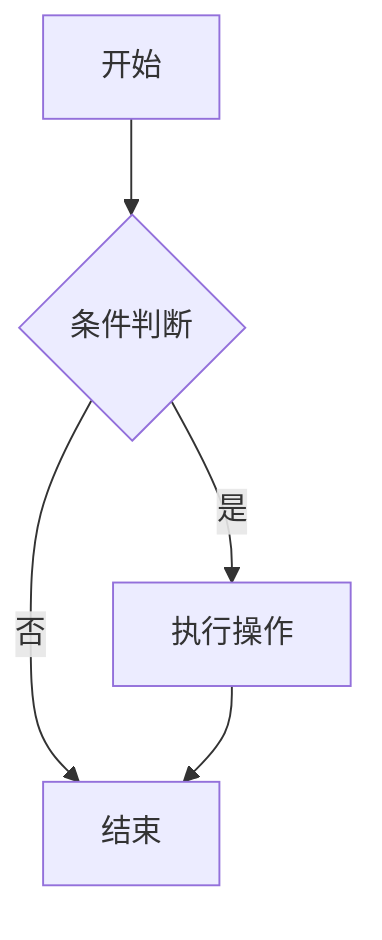
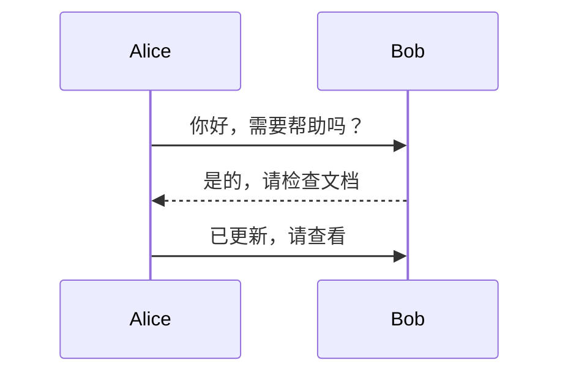
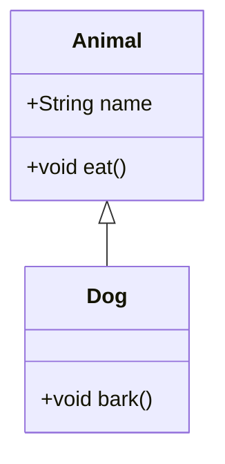
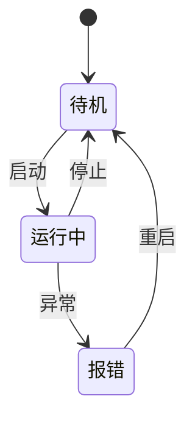
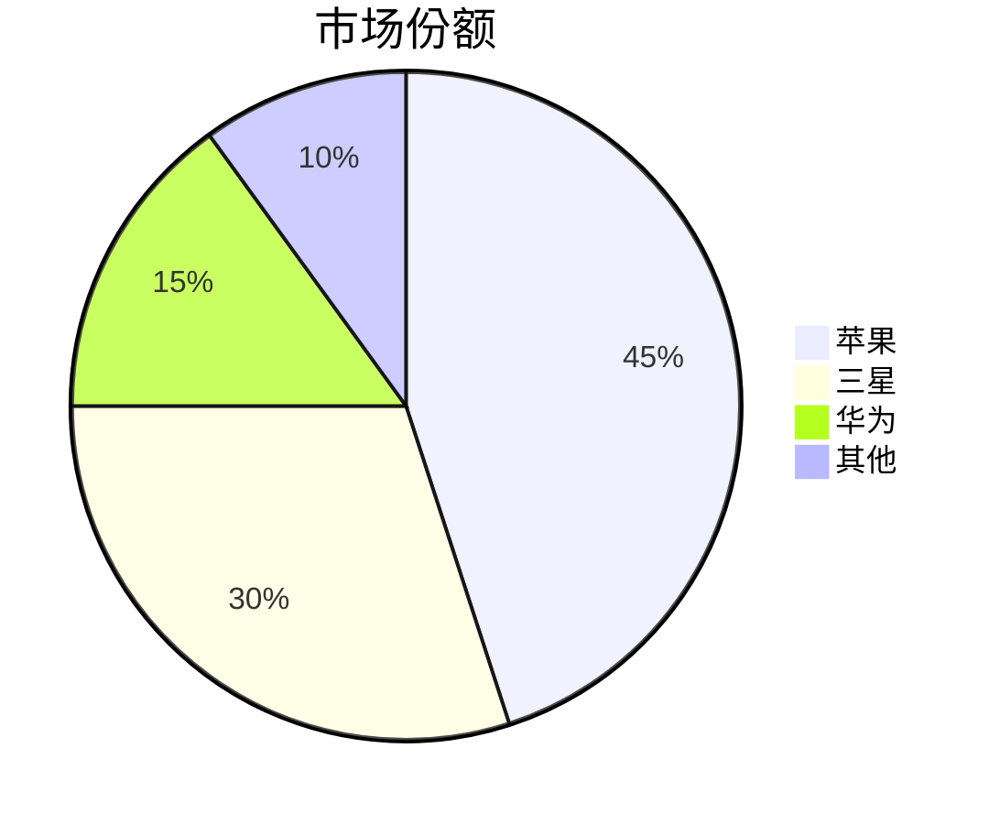
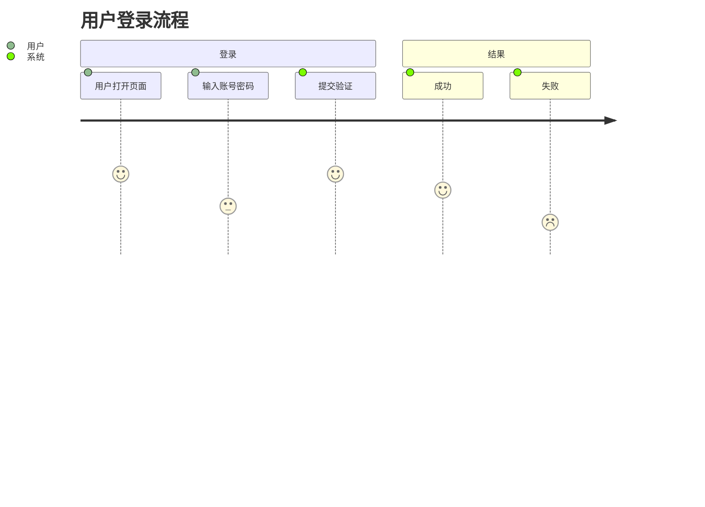

# Mermaid插件 #markdown #语法

Markdown 的 **Mermaid 插件** 是一种将文本代码转换为可视化图表的工具，它允许你在 Markdown 中直接编写图表定义，并实时渲染成图形。以下是其核心作用、支持的功能及实际应用场景的详细说明：

---

## 一、核心作用

1. 文本化图表  
   通过简单的代码语法（非图形界面）直接生成图表，无需依赖外部绘图工具（如 Visio、Draw.io）。

1. 版本控制友好  
   图表以纯文本形式存储，方便通过 Git 等工具进行版本管理和协作修改。

1. 无缝集成 Markdown  
   在 Markdown 文件中嵌入图表代码，渲染后与文档内容高度融合，提升可读性。

1. 实时预览  
   在 VS Code 等支持 Mermaid 的编辑器中，可实时查看图表效果，无需手动导出图片。

---

## 二、支持的图表类型与示例

Mermaid 支持多种常见图表类型，以下是主要类别及语法示例：

1. 流程图（Flowchart）
用于描述流程或步骤逻辑。

1. 序列图（Sequence Diagram）
展示对象之间的交互顺序。

1. 甘特图（Gantt Chart）
用于项目管理中的时间规划。

1. 类图（Class Diagram）
描述类与类之间的关系（面向对象设计）。

1. 状态图（State Diagram）
展示状态之间的转换逻辑。

1. 饼图（Pie Chart）
展示数据比例分布。

1. 用户旅程图（User Journey）
描述用户与系统的交互流程。

