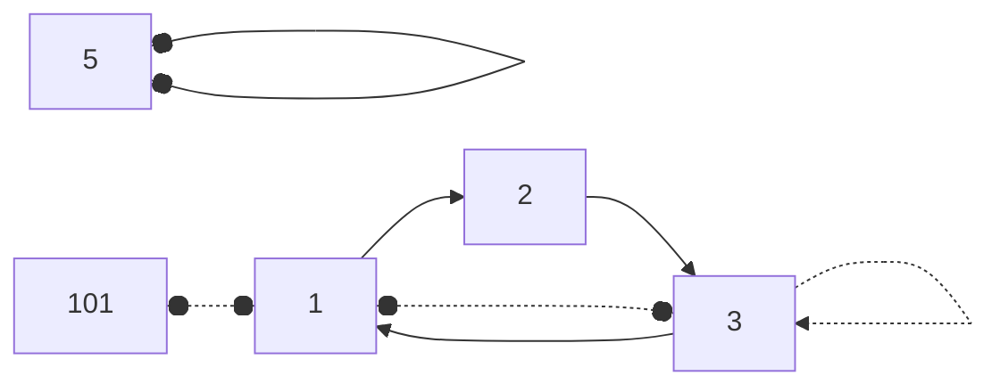
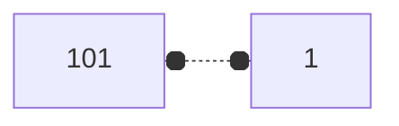
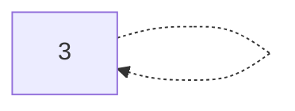
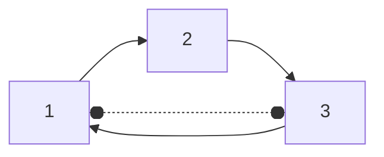
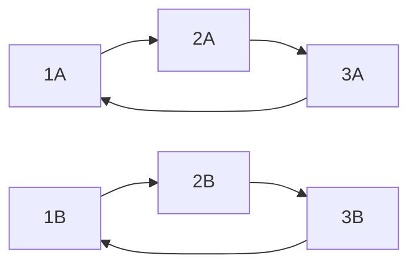

# P2024 [NOI2001] 食物链

## 题目描述

动物王国中有三类动物 $A,B,C$，这三类动物的食物链构成了有趣的环形。$A$ 吃 $B$，$B$ 吃 $C$，$C$ 吃 $A$。

现有 $N$ 个动物，以 $1 \sim N$ 编号。每个动物都是 $A,B,C$ 中的一种，但是我们并不知道它到底是哪一种。

有人用两种说法对这 $N$ 个动物所构成的食物链关系进行描述：

- 第一种说法是 `1 X Y`，表示 $X$ 和 $Y$ 是同类。
- 第二种说法是`2 X Y`，表示 $X$ 吃 $Y$。

此人对 $N$ 个动物，用上述两种说法，一句接一句地说出 $K$ 句话，这 $K$ 句话有的是真的，有的是假的。当一句话满足下列三条之一时，这句话就是假话，否则就是真话。

- 当前的话与前面的某些真的话冲突，就是假话；
- 当前的话中 $X$ 或 $Y$ 比 $N$ 大，就是假话；
- 当前的话表示 $X$ 吃 $X$，就是假话。

你的任务是根据给定的 $N$ 和 $K$ 句话，输出假话的总数。

## 输入格式

第一行两个整数，$N,K$，表示有 $N$ 个动物，$K$ 句话。

第二行开始每行一句话（按照题目要求，见样例）

## 输出格式

一行，一个整数，表示假话的总数。

## 输入输出样例 #1

### 输入 #1

```_
100 7
1 101 1
2 1 2
2 2 3
2 3 3
1 1 3
2 3 1
1 5 5
```

### 输出 #1

```_
3
```

## 说明/提示

对于全部数据，$1\le N\le 5 \times 10^4$，$1\le K \le 10^5$。

## 分析

### 样例分析



其中标虚线三条为假话



一共只有100个动物，出现101，为假话



自己吃自己，为假话



1吃2，2吃3，代表1与3必定不是同类，故1与3结盟为假话

### 数据范围

最多有$5\times10^4$个动物，故足够将每个动物所属"阵营"记录  
一共$10^5$次操作

### 思路构筑

#### 首个思路

使用数组存储每个动物代表的种族

- 对于结盟关系，将其留到最后判断
- 对于食用关系:
  - 若食用方种族不明:
    - 食用方=被食用方^(被食用方%3+1)
  - 若被食用方种族不明:
    - 被食用方=食用方%3+1
  - 若双方种族明确则判断是否出现吃错种族的情况

最终判断所有的结盟关系

问题:
对于两个集合的合并，



对于这两个食用关系，可能出现1A与2B事实上是同一个种族，但程序认为1A和1B是一个种族，在合并时会出现问题

#### 思路2

对于每种生物，记录他的上层捕食者和"层数",以及所在生态圈的前三位
每次出现吃人的情景时，连接其所在生态圈的顶层和对方生态圈的顶层

需要维护的数据:

- 上层捕食者(用于查询)
- 层数
- 捕食者A
- 捕食者B(用于与下层动物合并)
- 捕食者C(同上)

```cpp
struct Animal{
    Animal* N;
    int A,B,C,depth=0,0,0,0;
};
```

初始化:

```cpp
struct Animal{
    Animal* N;
    int A,B,C,depth=0,0,0,0;
    Animal(int i,Animal* n){
        A=i;
        N=n;
    }
};
```

查找:
如果自己在的位置为顶层，则不必查找，否则向上查找，并确认深度，每上升三层则将自己上移

```cpp
struct Animal{
    Animal* N;
    int up,A,B,C,depth=0,0,0,0,0;
    int find(int i,int d){
        if(up==N[i].up){depth=d;return i;}
        if (d%=3==0)up=N[i].up;
        A=N[i].A;
        B=N[i].B;
        C=N[i].C;
        return find(N[i].up,d+1);
    }
};
```

合并:
将后者并至前者的树

```cpp
struct Animal{
    Animal* N;
    int up,A,B,C,depth=0,0,0,0,0;
    int unite(int i){
        N[i].up=up;
    }
};
```

食用:
将后者的上级设为自己
