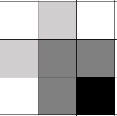

# P3869 [TJOI2009] 宝藏 #OI #已解决题目 #状态压缩DP

## 题目描述

为了寻找传说中的宝藏，小明走进了一个迷宫，我们用一个 $r$ 行 $c$ 列的矩阵来描述这个迷宫，矩阵的每个位置表示一个方块区域：

- 字符 `.` 表示可以通过的方格。
- 字符 `#` 表示不能通过的方格。
- 在迷宫中有 $k$ 个机关，第 $i$ 个机关工作方式为：  
  - 每当小明走上第 $r_i$ 行，$c_i$ 列的格子时，位于第 $R_i$ 行，$C_i$ 列的格子改变状态（如果这个格子此时可以通过，此后就变为不能通过；如果此时不能通过，此后可以通过。最左上角的格子是第 $1$ 行第 $1$ 列）。

现给出当前小明的位置，宝藏的位置，迷宫中每个格子的状态，以及所有机关的描述，问小明至少还要走多少步才能拿到宝藏（不能走出迷宫的边界，在开始时刻，小明和宝藏所在的位置都是可以通过的，机关不会出现在起点和终点，也不会影响这两个格子）。

## 输入格式

输入数据的第 $1$ 行是两个整数：$r$ 和 $c$。

输入数据的第 $2$ 行到第 $r+1$ 行，每行是一个长度为 $c$ 的字符串，描述迷宫的当前状态：`.` 表示此时可以通过的格子，`#` 表示此时不能通过的格子，`S` 表示起点，`T` 表示宝藏的位置。

输入数据的第 $r+2$ 行是一个整数 $k$，表示机关的数目。接下来有 $k$ 行，每一行包含 $4$ 个整数 $r_i,c_i,R_i,C_i$，用来描述一个机关。

## 输出格式

输出一个整数：小明最少需要走多少步才能拿到宝藏。测试数据保证可以找到宝藏。

## 输入输出样例 #1

### 输入 #1

```_
5 5
S.#..
#####
..#..
##.#.
...#T
6
1 5 4 2
1 4 3 3
5 1 3 3
1 4 4 5
1 2 1 3
1 5 2 1
```

### 输出 #1

```_
22
```

## 说明/提示

### 数据范围及约定

对于全部数据，$5 \le r, c \le 30$，$0 \le k \le 10$，$1 \le r_i,R_i\le r$，$1 \le c_i,C_i \le c$。

>最后更新：2025-08-25 05:28

## 解析

由于出现了会变动的格子，不同地图的总数有$2^{10}=1024$张，再加上每张地图$30*30=900$格子，不重复状态数共有$1024*900=921600$种

先试试这种列举所有状态的思路

```cpp
#include <iostream>
#include <queue>
using namespace std;

int rs,cs;
int map[35][35];
short dp[35][35][1100];
struct trap{
    int r,c,r2,c2;
}traps[15];


int sr,sc,tr,tc;

int k;

int main(){
    cin>>rs>>cs;
    for(int i=1;i<=rs;i++){
        for(int j=1;j<=cs;j++){
            char x;
            cin>>x;
            if(x=='S'){
                sr=i;sc=j;
            }
            if(x=='T'){
                tr=i;tc=j;
            }
            if(x=='#')map[i][j]=1;
            else map[i][j]=0;
        }
    }
    cin>>k;
    for(int i=0;i<k;i++){
        cin>>traps[i].r>>traps[i].c>>traps[i].r2>>traps[i].c2;
    }
    queue<int>qur;
    queue<int>quc;
    queue<int>qus;
    queue<int>qut;
    qur.push(sr);
    quc.push(sc);
    qus.push(0);
    qut.push(0);
    int d[4][2]={{0,1},{0,-1},{1,0},{-1,0}};
    
    int r,c,s,t;
    while (qur.size()){
        r=qur.front();
        c=quc.front();
        s=qus.front();
        t=qut.front();
        qur.pop();
        quc.pop();
        qus.pop();
        qut.pop();
        if(r==tr&&c==tc){
            cout<<s;
            break;
        }
        for(int i=0;i<k;i++){
            if(r==traps[i].r&&c==traps[i].c){
                t^=(1<<i);
            }
            if(t>>i&1){
                //cout<<1;
                map[traps[i].r2][traps[i].c2]^=1;
            }
        }
        dp[r][c][t]=s;
        for(int i=0;i<4;i++){
            int rp=r+d[i][0];
            int cp=c+d[i][1];
            
            if(rp<=0||cp<=0||rp>rs||cp>cs)continue;
            if(!map[rp][cp]&&dp[rp][cp][t]==0){
                qur.push(rp);
                quc.push(cp);
                qus.push(s+1);
                qut.push(t);
            }
        }
        for(int i=0;i<k;i++){
            if(t>>i&1)map[traps[i].r2][traps[i].c2]^=1;
        }
        //cout<<r<<" "<<c<<" "<<s<<" "<<t<<endl;
    }
    return 0;
}
```

每次向四周移动一步，使用t值分离每个机关是否有被触发


最终得分50,5AC,1WA,1TLE,3MLE

优化策略:

1. 算法补错:目前算法会出现多次重复统计的情况，见示意图  
      
    解决方案:`dp[rp][cp][t]=-1;`,标记即将统计的格子，防止重复

2. 特殊问题:
    缺少起点特判

3. 细节优化:
    我们仅需得到终点的距离，故dp仅需标志位，队列中存储步数即可

### 最终代码

```cpp
#include <iostream>
#include <queue>
#include <fstream>
using namespace std;

int rs,cs;
int map[35][35];
bool dp[35][35][2100];
struct trap{
    int r,c,r2,c2;
}traps[15];


int sr,sc,tr,tc;

int k;

int main(){
    cin>>rs>>cs;
    for(int i=1;i<=rs;i++){
        for(int j=1;j<=cs;j++){
            char x;
            cin>>x;
            if(x=='S'){
                sr=i;sc=j;
            }
            if(x=='T'){
                tr=i;tc=j;
            }
            if(x=='#')map[i][j]=1;
            else map[i][j]=0;
        }
    }
    cin>>k;
    for(int i=0;i<k;i++){
        cin>>traps[i].r>>traps[i].c>>traps[i].r2>>traps[i].c2;
    }
    queue<int>qur;
    queue<int>quc;
    queue<int>qus;
    queue<int>qut;
    qur.push(sr);
    quc.push(sc);
    qus.push(0);
    qut.push(0);
    dp[sr][sc][0]=true;
    int d[4][2]={{0,1},{0,-1},{1,0},{-1,0}};
    
    int r,c,s,t;
    while (qur.size()){
        r=qur.front();
        c=quc.front();
        s=qus.front();
        t=qut.front();
        qur.pop();
        quc.pop();
        qus.pop();
        qut.pop();
        if(r==tr&&c==tc){
            cout<<s;
            break;
        }
        for(int i=0;i<k;i++){
            if(r==traps[i].r&&c==traps[i].c){
                t^=(1<<i);
            }
            if(t>>i&1){
                map[traps[i].r2][traps[i].c2]^=1;
            }
        }
        for(int i=0;i<4;i++){
            int rp=r+d[i][0];
            int cp=c+d[i][1];
            
            if(rp<=0||cp<=0||rp>rs||cp>cs)continue;
            if(!map[rp][cp]&&dp[rp][cp][t]==false){
                dp[rp][cp][t]=true;
                qur.push(rp);
                quc.push(cp);
                qus.push(s+1);
                qut.push(t);
            }
        }
        for(int i=0;i<k;i++){
            if(t>>i&1)map[traps[i].r2][traps[i].c2]^=1;
        }
        //cout<<r<<" "<<c<<" "<<s<<" "<<t<<endl;
    }
    return 0;
}
```

### 使用样例

测试样例，不再赘述

空地图:

```_
30 30
S..................................................................................................................................................................................................................................................................................................................................................................................................................................................................................................................................................................................................................................................................................................................................................................................................................................................................................................................................T
10
1 1 2 1
1 2 2 2
1 3 2 3
1 4 2 4
1 5 2 5
1 6 2 6
1 7 2 7
1 8 2 8
1 9 2 9
1 10 2 10
```
