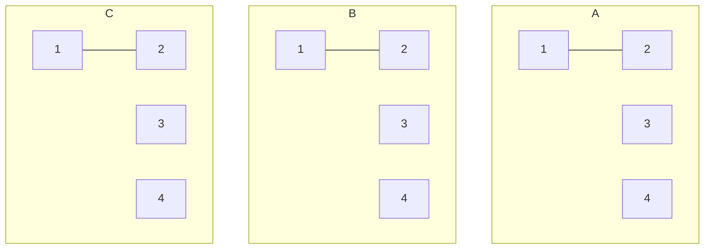
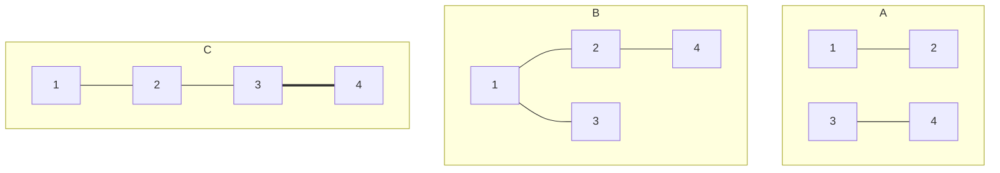
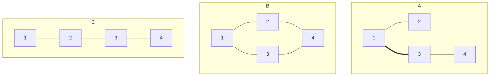

# P8026 [ONTAK2015] Bajtocja

## 题目描述

给定 $d$ 张无向图，每张图都有 $n$ 个点。一开始，在任何一张图中都没有任何边。接下来有 $m$ 次操作，每次操作会给出 $a, b, k$，意为在第 $k$ 张图中的点 $a$ 和点 $b$ 之间添加一条无向边。你需要在每次操作之后输出有序数对 $(a, b)$ 的个数，使得 $1 \leq a, b \leq n$，且 $a$ 点和 $b$ 点在 $d$ 张图中都连通。

## 输入格式

第一行，三个整数 $d, n, m$；

接下来 $m$ 行，每行三个整数 $a, b, k$。

## 输出格式

$m$ 行，每行一个整数，表示所求的值。

## 输入输出样例 #1

### 输入 #1

```_
3 4 10
1 2 1
2 1 2
1 2 3
3 4 1
1 3 2
2 3 3
2 4 2
3 4 3
3 4 2
1 3 1
```

### 输出 #1

```_
4
4
6
6
6
6
6
8
8
16
```

## 说明/提示

对于 $100\%$ 的数据，$1 \leq d \leq 200$，$1 \leq n \leq5 \times 10^3$，$1\leq m \leq 10^6$，$1 \leq a, b \leq n$，$1 \leq k \leq d$。

## 解析

### 样例分析

数据范围:三张图(1,2,3),四个点(1,2,3,4),十次操作

最初情况:所有点之间互不连接，此时有序数对分别为四个点

第三次操作:



此时除了数对$(1,1),(2,2),(3,3),(4,4)$,又新增了$(1,2),(2,1)$

第八次操作:



此时新增了两个数对:$(3,4),(4,3)$

第十次操作:



此时全图连通，共有数对16个

$$
\begin{matrix}
    (1,1),(1,2),(1,3),(1,4)\\
(2,1),(2,2),(2,3),(2,4)\\
(3,1),(3,2),(3,3),(3,4)\\
(4,1),(4,2),(4,3),(4,4)\\
\end{matrix}

$$

### 分析数据范围

最多有$5\times10^3$个点,统计每两个点的连接情况则有$2.5\times10^7$个  
操作最多有$10^6$次  
最多有200张图  
一共可能有$200\times(5\times10^3)^2/2=2.5\times10^8$条边  
有$200*5\times10^3=10^6$个不同的点  

### 思路构建

1. 每次操作后有序数对数量都是单调不减的，每次操作后仅需统计增加了多少有序数对
2. 有序数对要求在每个图都连通

模拟题目思路:

对于每次操作,遍历该图两点连接的所有点，并判断他们在其他图是否有连接  
空间复杂度:记录每个点直接的连接  
时间复杂度:每次查询查询全部节点的全部200张图的值，$10^6*5\times10^3*200=10^{12}$

优化1:

- 统计点时仅需关注所有区域的交集，对于每个集合，数对数=元素数^2

思路2:

对于每个图的每个点，只记录它在哪个区域里
对于每个区域，记录其所包含的元素
每次操作，合并两个图中的元素，并计算其过程中产生了多少数对
