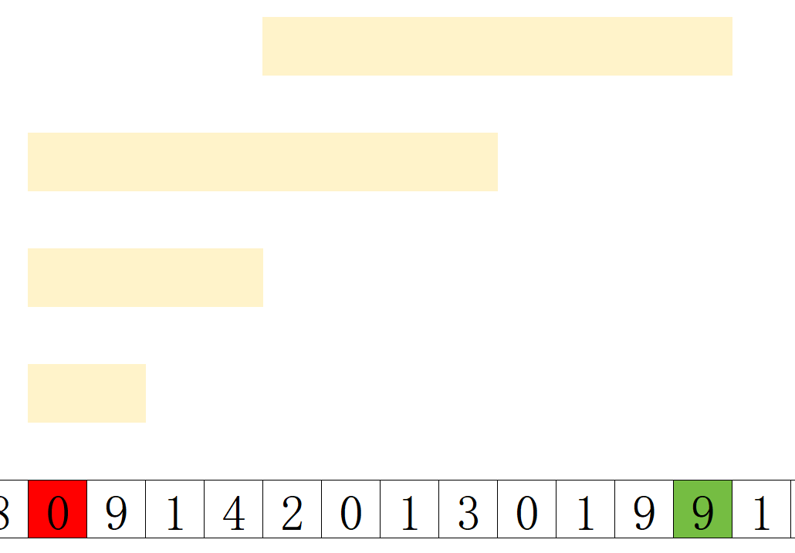

# 稀疏表 #OI #算法 #数据结构

>最后更新：2025-08-26 10:31

稀疏表，又称ST表(Sparse Table)

官方语:是用于解决 **可重复贡献问题** 的数据结构。
>可重复贡献问题 是指对于运算 $\operatorname{opt}$，满足 $x\operatorname{opt} x=x$，则对应的区间询问就是一个可重复贡献问题。例如，最大值有 $\max(x,x)=x$，gcd 有 $\operatorname{gcd}(x,x)=x$，所以 RMQ 和区间 GCD 就是一个可重复贡献问题。像区间和就不有这个性质，如果求区间和的时候采用的预处理区间重叠了，则会导致重叠部分被计算两次，这是我们所不愿意看到的。另外，$\operatorname{opt}$ 还必须满足结合律才能使用 ST 表求解。

个人解释:我们能容许区间有部分重合的情况，重复统计不会影响结果

>RMQ 是英文 Range Maximum/Minimum Query 的缩写，表示区间最大（最小）值。解决 RMQ 问题有很多种方法，可以参考 RMQ 专题。

[模板题](../../luoguP/普及提高-/P3865/P3865.md)

ST表是基于[倍增思想](../思想/倍增思想.md)的一种数据结构，其中预处理时间 $O(n\log n)$ 单次查询时间 $O(1)$ 不支持修改

我们考虑使用ST表求区间最大值  

预处理部分
我们令 $f[i][j]$ 表示区间 $[i,i+2^j-1]$的最大值  
则 $f[i][0]=f[i]$  
$f[i][1]=max(f[i][0],f[i+1][0])$  
$f[i][2]=max(f[i][1],f[i+2^1][1])$  
$f[i][j]=max(f[i][j-1],f[i+2^{j-1}][j-1])$

查询部分
对于查询 $[l,r]$ 不难发现最多仅需两个区间就能完全覆盖
即 $[l,l+2^{s}-1],[r-2^s+1,r]$
其中 $s=\lfloor\log_2(r-l+1)\rfloor$



示意代码:

```cpp
# include<iostream>
using namespace std;
const int N=1e6+10;
const int logN=30;
int log_[N];
int f[N][logN];
void prelog(){
    log_[1]=0;
    log_[2]=1;
    for(int i=2;i<N;i++){
        log_[i]=log_[i/2]+1;
    }
}
int main(){
    int n,m;
    prelog();
    cin>>n>>m;
    for(int i=1;i<=n;i++){
        cin>>f[i][0];
    }
    for(int j=1;j<=logN;j++){
        for(int i=1;i+(1<<j)-1<=n;i++){
            f[i][j]=max(f[i][j-1],f[i+(1<<(j-1))][j-1]);
        }
    }
    int l=0,r=0,s=0;
    while(m--){
        cin>>l>>r;
        s=log_[r-l+1];
        cout<<max(f[l][s],f[r-(1<<s)+1][s])<<'\n';
    }
    return 0;
}
```
