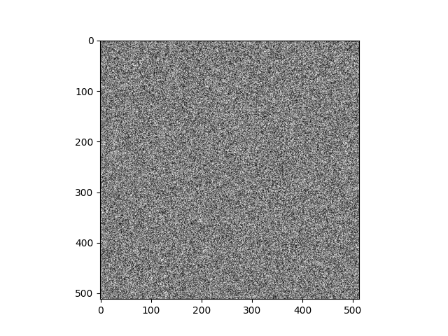
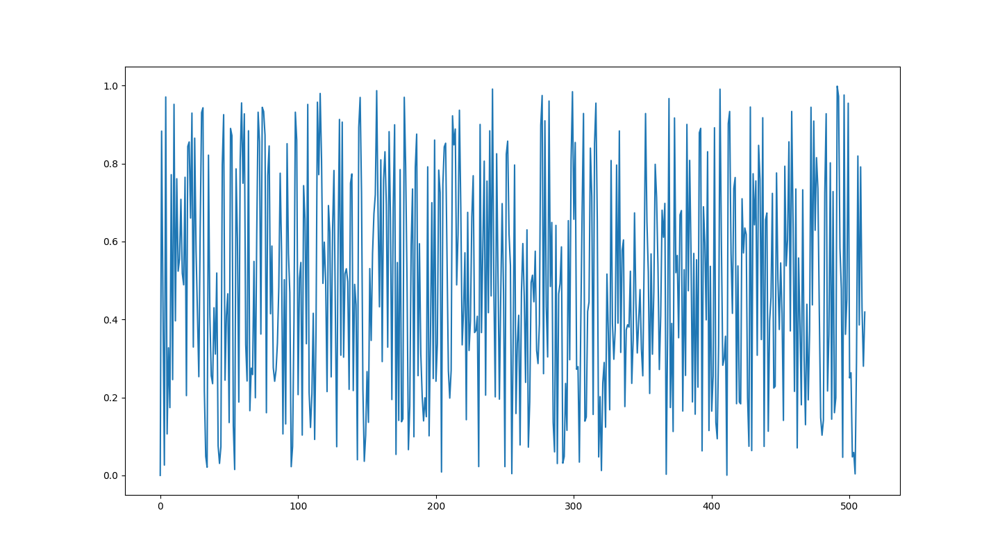
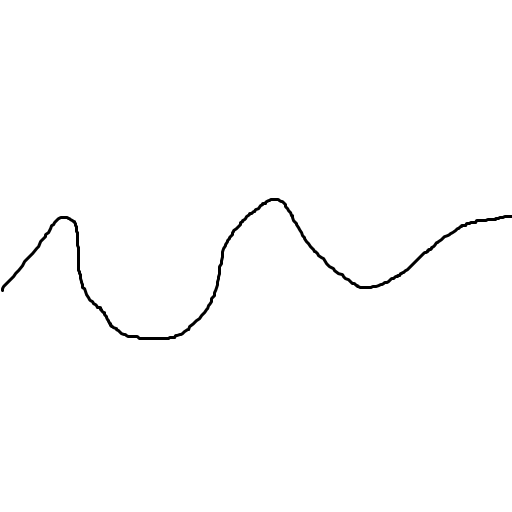
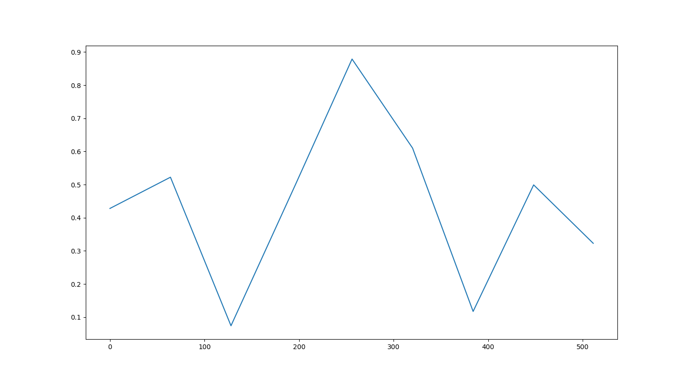
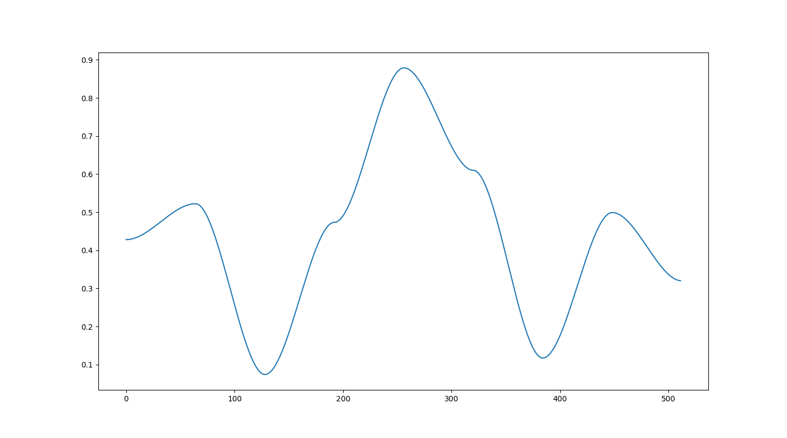
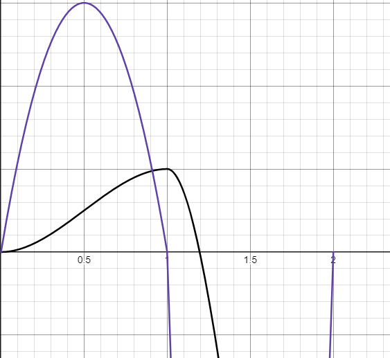
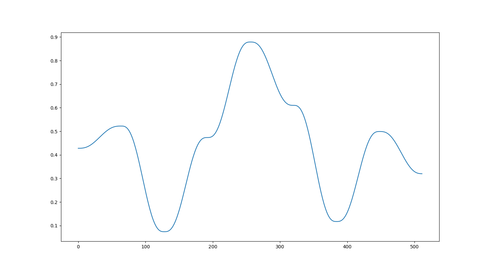

# 柏林噪声 #算法 #随机 #实现原理

>最后更新：2025-04-21 20:49

讲到minecraft的世界生成，总有一个词是绕不开的："柏林噪声"

## 意义/用途

首先我们要知道，什么是噪声？
噪声，其实就是一种特殊的随机数生成器
回想一下，生活中的一些东西都可以用随机来表示

- 高低起伏的山脉
- 天空中飘忽不定的云彩
- 石头上细微的纹理

噪声就是为了他们而产生的
知道了这点，我们再回去观察之前的几个例子，他们在普通的随机上都有一个共同的特点：**平滑**
可以想象一下，一座山每一步都有属于自己的单独的高度，一会扶摇直上九万里，一会飞流直下三千尺，那得是怎样一番景象

一般来说，你可能也会听到一种名叫"噪声图"的东西，它就是二维噪声的表现形式，图上每个点的颜色对应着该点的值，使用时可以把对应位置的值代入到具体环境中使用，比如把值转换成高度，(图上对应位置的点)颜色越深(对应的地形)高度越高。

知道了这些，我们也可以开始制作我们的噪声函数

先准备一段代码，用来显示灰度图

```python
import numpy as np
import matplotlib.pyplot as plt
import random

SIZE=512

def f(x,y):
    return random.random()


def show_noise2d():
    arr=np.fromfunction(f,(SIZE,SIZE))
    plt.imshow(arr,cmap ='gray',vmin=0,vmax=1)
    plt.show()

show_noise2d()
```

运行代码，我们得到了一个完全随机的噪声图，这种噪声被称作"白噪声"


这样乱七八糟的图我相信大家一时间注意不到怎么优化，那我们先从更简单的情况入手

## 一维噪声函数

```python
import numpy as np
import matplotlib.pyplot as plt
import random

SIZE=512

def f(x):
    return random.random()

def show_noise1d():
    arr=np.fromfunction(f,(SIZE,))
    plt.plot(arr)
    plt.show()
```

于是我们就得到了这堆线段

而我们需要的可能是这样

根据这张图，我们发现其实画一座山很简单，只要得到山峰山谷的位置，然后把他们连起来即可  

那我们就把它拆解成两个小问题：

- 如何得到特殊点的位置
- 如何将中间的点连起来

得到位置这个还算简单，我们可以先设每隔N个点的点作为特殊点，于是我们就得到了一条被多个特殊点分割成一段段的线段，只要把左右两个特殊点中间的点串起来就行了

那该怎么把两个特殊点中间的点串起来呢?
首先，我们得先找到距离这个点最近的两个特殊点找出来
经过简单的计算，可知左端点=N*(x//N),右端点=N*((x)//N)+1

好了，我们有了端点的位置，那我们怎么得到它的高度呢
把端点的高度全存进一个数组?那样内存绝对会爆的
让我们往回拨，我们是怎么生成端点高度的
我们使用了random.random()生成[0,1)范围内的随机数
那我们现在需要什么
我们需要通过端点坐标得到端点的高度

也就是说，只需要一个函数能使坐标和高度产生1对1的关系，又保证输出数据和输入数据没有明显联系，其实就是根据坐标生成随机数
那就需要我们手写一份随机数生成算法
实现方式有很多,比如 线性同余生成器`LCG`,梅森旋转算法`MT`,`Xorshift`算法等，这里就不展开太多了
这里使用`Xorshift32`算法来生成，其主要逻辑如下

```python
def Xorshift32(n):
    n ^= (n << 13)
    n ^= (n >> 17)
    n ^= (n << 5)
    return n/0xFFFFFFFF # 归一化
```

现在我们得到了最近两个端点的坐标和高度，现在我们只需要根据这些点连接起来
让我们画一条连接两个点的曲线，让我们定位我们的连接函数需要哪些输入

对于线上每个点，我们都要根据它在两点间的**相对位置**来决定，越靠近左边的点与左端点的差越小，越靠近右边的点与右端点的差越小
那其他参数呢?我们会需要它的绝对坐标吗，不需要，将这三个点平移，结果仍然不变。我们需要两个点的高度吗?将端点的高度做出变化，这条连接线的位置也跟着平移，缩放，我们可以让线上的每个点加上偏移值，再乘以缩放倍率，基础的曲线只需在0-1的范围内，穿过(0,0)和(1,1)点就可以了

重新观察这个函数，其实我们做的就相当于一个进度条，拖动底下的滑块，得到对应的高度值。使用时，把这个"进度条"安装到两个点之间即可

至于这条线，现在随便画一条满足要求的，就y=x了

现在，我们有了所有所需的工具，让我们写出来看看效果

```python
import numpy as np
import matplotlib.pyplot as plt

SIZE=512
LATTICE_SIZE=64

def rand(n):
    n = n.astype(np.uint32)
    n = n + np.uint32(0x9E3779B9)
    n ^= np.left_shift(n, 17)
    n ^= np.right_shift(n, 13)
    n ^= np.left_shift(n, 5)
    n = n * np.uint32(0x9E3779B9)
    n ^= np.right_shift(n, 15)
    n ^= np.left_shift(n, 7)

    positive_n = (n & np.uint32(0xFFFFFFFF)).astype(np.float32)
    return positive_n / np.float32(0xFFFFFFFF)

def fade(x):
    return x

def f(x):
    left_point=x//LATTICE_SIZE
    left=rand(left_point)
    right_point=x//LATTICE_SIZE+1
    right=rand(right_point)
    t=(x-left_point*LATTICE_SIZE)/LATTICE_SIZE
    return left+fade(t)*(right-left)

def show_noise1d():
    arr=np.fromfunction(f,(SIZE,))
    plt.plot(arr)
    plt.show()

show_noise1d()
```



很明显这个结果我们并不满意，为什么呢?因为不够"平滑"  

### 插值

我们的插值函数只是用了一条直线连接起来，在**拐点**处会有明显的转折
也就是说，我们的插值函数还需要能够让这些线*首尾相接*

让我们把视线聚焦到拐点两侧，在拐点的位置把这两条线延长，它们往两个不同的方向前进，于是我们可以确定这是两条不一样的线  
那我们要让他们首尾相接，就得需要延申出来的直线重合才行  
再仔细看其中一条线，它会随着这条线的缩放变换它的方向，那有什么不会因缩放变换方向的东西呢?

有的兄弟，有的

当拐点的斜率为0，它的方向始终指向右方，无论怎么缩放这条线，它的方向始终不会改变  
于是我们得到了插值函数需要的另外两个特性:在x=0和x=1处斜率为0
现在我们的函数需要满足

$$
\begin{cases}
f(0)=0 \\
f(1)=1 \\
f'(0)=0 \\
f'(1)=0 \\
\end{cases}
$$

为了满足这4个条件，我们最少需要一个三次函数，那设其为
$f(x)=ax^3+bx^2+cx+d$

将我们得到的四个条件代入得到这样一个方程组

$$
f'(x)= 3ax^2+2bx+c \\
\begin{cases}
a*0^3+b*0^2+c*0+d=0 \\
a*1^3+b*1^2+c*1+d=1 \\
3a*0^2+2b*0+c=0 \\
3a*1^2+2b*1+c=0 \\
\end{cases}
$$

化简得到

$$
\begin{cases}
d=0 \\
a+b=1 \\
c=0 \\
3a+2b=0 \\
\end{cases}
$$

得

$$
\begin{cases}
a=-2 \\
b=3 \\
c=0 \\
d=0 \\
\end{cases} \\
f(x)=-2x^3+3x^2
$$

用新的插值函数替代之前的，再次运行代码


**恭喜你！** 你成功发明了值噪声`value noise`函数

这个函数已经基本达成我们的目标了，但仍然有许多优化空间

第一个问题，它在连接处仍然显得尖尖的
我们可以看连接处两条曲线求导后的函数


其中紫色的线是求导后的函数，可以发现，在转折处斜率变化不平滑，如果差距较大会显得尖锐
那就使它的二阶导同样满足在x=0,x=1两点斜率为0,得到优化后的五次插值函数(推导过程同上，此处不做展开)

$$f(x)=6x^5-15x^4+10x^3$$

使用优化后的函数，就很难出现肉眼可见的尖锐转折了


### 梯度
