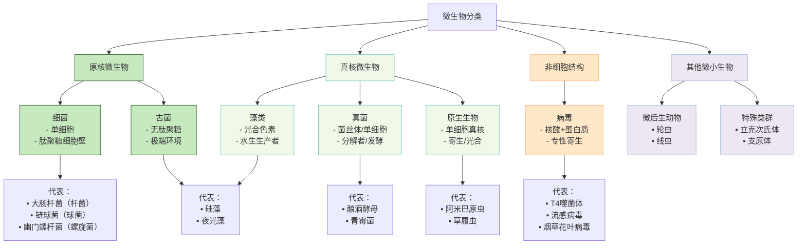

# 微生物 #待分类内容 #生物 #学科

```mermaid
%% Mermaid微生物分类图表代码
flowchart TD
%% 1. 图表全局定义
    classDef prokaryote fill:#c7e9c0,stroke:#2d5a27;
    classDef eukaryote fill:#f0f9e8,stroke:#7bccc4;
    classDef noncellular fill:#fee8c8,stroke:#fdbb84;
    classDef other fill:#ece7f2,stroke:#a6bddb;

%% 2. 核心分类结构
    Root["微生物分类"] --> Prokaryote["原核微生物"]
    Root --> Eukaryote["真核微生物"]
    Root --> NonCellular["非细胞结构"]
    Root --> Others["其他微小生物"]

%% 3. 原核微生物分支
    Prokaryote --> Bacteria["细菌
        - 单细胞
        - 肽聚糖细胞壁"]
    Prokaryote --> Archaea["古菌
        - 无肽聚糖
        - 极端环境"]

    Bacteria --> B_Examples["代表：
        ▪ 大肠杆菌（杆菌）
        ▪ 链球菌（球菌）
        ▪ 幽门螺杆菌（螺旋菌）"]
    Archaea --> A_Examples["代表：
        ▪ 甲烷杆菌
        ▪ 火山热叶菌
        ▪ 盐杆菌"]

%% 4. 真核微生物分支
    Eukaryote --> Fungi["真菌
        - 菌丝体/单细胞
        - 分解者/发酵"]
    Eukaryote --> Protists["原生生物
        - 单细胞真核
        - 寄生/光合"]
    Eukaryote --> Algae["藻类
        - 光合色素
        - 水生生产者"]

    Fungi --> F_Examples["代表：
        ▪ 酿酒酵母
        ▪ 青霉菌"]
    Protists --> P_Examples["代表：
        ▪ 阿米巴原虫
        ▪ 草履虫"]
    Algae --> A_Examples["代表：
        ▪ 硅藻
        ▪ 夜光藻"]

%% 5. 非细胞结构分支
    NonCellular --> Viruses["病毒
        - 核酸+蛋白质
        - 专性寄生"]
    Viruses --> V_Examples["代表：
        ▪ T4噬菌体
        ▪ 流感病毒
        ▪ 烟草花叶病毒"]

%% 6. 其他分支
    Others --> Microfauna["微后生动物
        ▪ 轮虫
        ▪ 线虫"]
    Others --> Special["特殊类群
        ▪ 立克次氏体
        ▪ 支原体"]

%% 7. 样式应用
    class Prokaryote,Bacteria,Archaea prokaryote;
    class Eukaryote,Fungi,Protists,Algae eukaryote;
    class NonCellular,Viruses noncellular;
    class Others,Microfauna,Special other;
```
