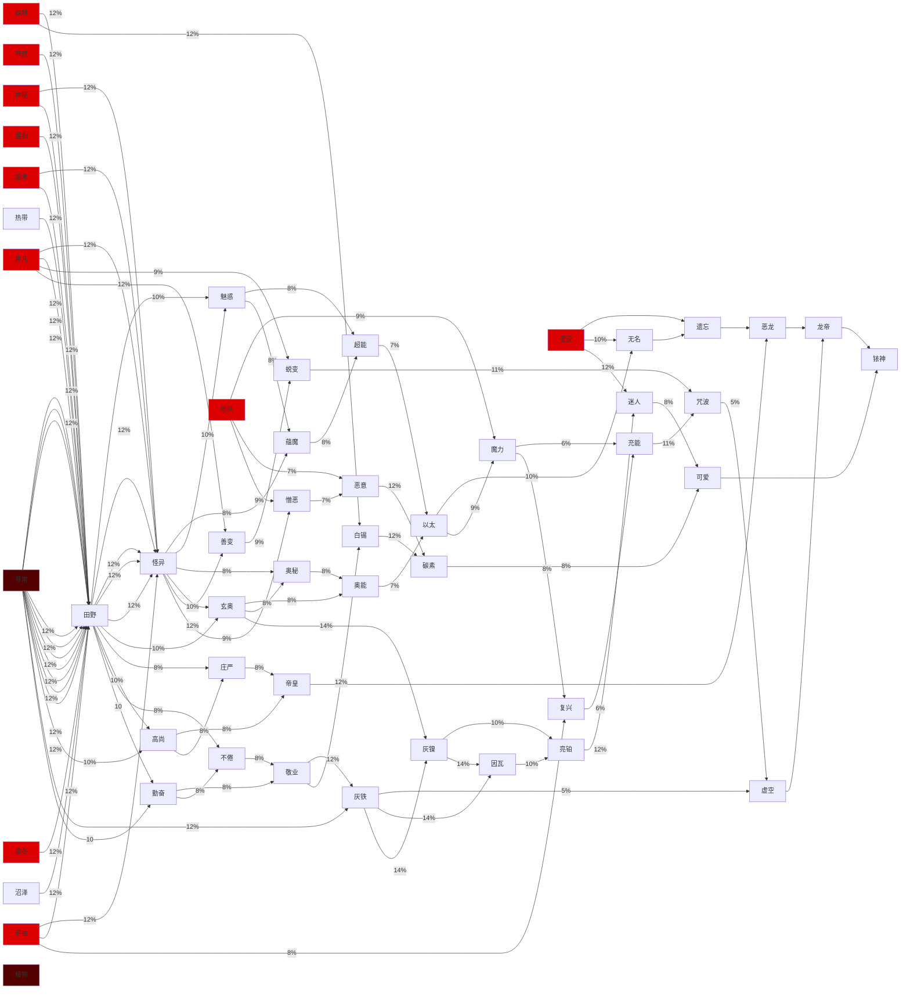

# 林业养蜂杂交路径 #minecraft #科技模组

>最后更新：2025-03-15 17:29

```mermaid
flowchart LR
    高尚 & 庄严 -->|8%| 帝皇
    
    虚空 & 恶龙 --> 龙帝
    帝皇 & 遗忘 --> 恶龙
    湮没 & 无名 --> 遗忘
    以太 & 湮没 -->|10%| 无名
    奥能 & 超能 -->|7%| 以太
    魅惑 & 蕴魔 -->|8%| 超能
    怪异 & 魅惑 -->|8%| 蕴魔
    田野 & 怪异 -->|10%| 魅惑
    神秘 & 田野 -->|12%| 怪异
    巫术 & 田野 -->|12%| 怪异
    非凡 & 田野 -->|12%| 怪异
    谐振 & 田野 -->|12%| 怪异
    寻常 & 森林 -->|12%| 田野
    寻常 & 草原 -->|12%| 田野
    寻常 & 温和 -->|12%| 田野
    寻常 & 热带 -->|12%| 田野
    寻常 & 凛冬 -->|12%| 田野
    寻常 & 沼泽 -->|12%| 田野
    神秘 & 寻常 -->|12%| 田野
    巫术 & 寻常 -->|12%| 田野
    非凡 & 寻常 -->|12%| 田野
    谐振 & 寻常 -->|12%| 田野
    玄奥 & 奥秘 -->|8%| 奥能
    怪异 & 玄奥 -->|8%| 奥秘
    田野 & 怪异 -->|10%| 玄奥
    高尚 & 田野 -->|8%| 庄严
    寻常 & 田野 -->|10%| 高尚
    灰铁 & 咒波 -->|5%| 虚空
    蜕变 & 充能 -->|11%| 咒波
    魔力 & 复兴 -->|6%| 充能
    谐振 & 魔力 -->|8%| 复兴
    以太 & 地狱 -->|9%| 魔力
    非凡 & 善变 -->|9%| 蜕变
    非凡 & 怪异 -->|12%| 善变
    寻常 & 敬业 -->|12%| 灰铁
    勤奋 & 不倦 -->|8%| 敬业
    勤奋 & 田野 -->|8%| 不倦
    寻常 & 田野 -->|10| 勤奋
    可爱 & 龙帝 --> 铱神

    迷人 & 碳素 -->|8%| 可爱
    恶意 & 白锡 -->|12%| 碳素
    敬业 & 森林 -->|12%| 白锡
    地狱 & 憎恶 -->|7%| 恶意
    地狱 & 怪异 -->|9%| 憎恶
    
    亮铂 & 湮没 -->|12%| 迷人
    灰镍 & 因瓦 -->|10%| 亮铂
    灰铁 & 灰镍 -->|14%| 因瓦
    灰铁 & 玄奥 -->|14%| 灰镍
    style 森林 fill:#d00
    style 草原 fill:#d00
    style 湮没 fill:#d00
    style 温和 fill:#d00
    style 凛冬 fill:#d00
    style 非凡 fill:#d00
    style 神秘 fill:#d00
    style 地狱 fill:#d00
    style 谐振 fill:#d00
    style 巫术 fill:#d00
    style 寻常 fill:#500
    style 植物 fill:#500
```

植物 & 花开 -->|8%| 花海
    植物 & 土 -->|12%| 花开
    超能 & 以太 -->|14%| 土
