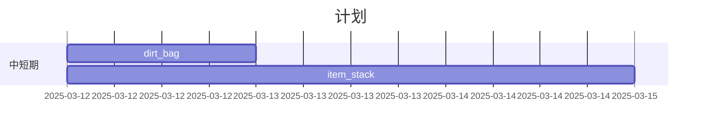

# 2025-03-11 #日志 #日记 #2025第一季度

>最后更新：2025-03-11 21:47

## 今日编写内容

1. Mermaid插件.md
1. dirt_bag制作

## 后续任务(预计)

- 明日：
  - 编写完整dirt_bag文档(1d)
  - 编写item_stack文档(3d)



## 日记

```text
这应该是我第一次写日志/日记，对格式不好把握

现在大致的格式，代码什么的都得靠deepseek给，不过至少现在知道有了大纲怎么填充

学科方面
今天化学，物理月考，蒙/猜部分过半，总体感觉良好

个人方面
很明显这样偏正式的文档风格也影响了日记内容文字风格(?)，但是对于字词的斟酌还没做好，多有形容不当之处
```

>最后更新：2025-03-11 23:46

```text
还有高手
dirt bag未能正常实现功能，留到明天吧
1. id返回错误，检查并重写block item的get id之类的
2. mineBlock函数没写，抄DiggerItem的代码
```
