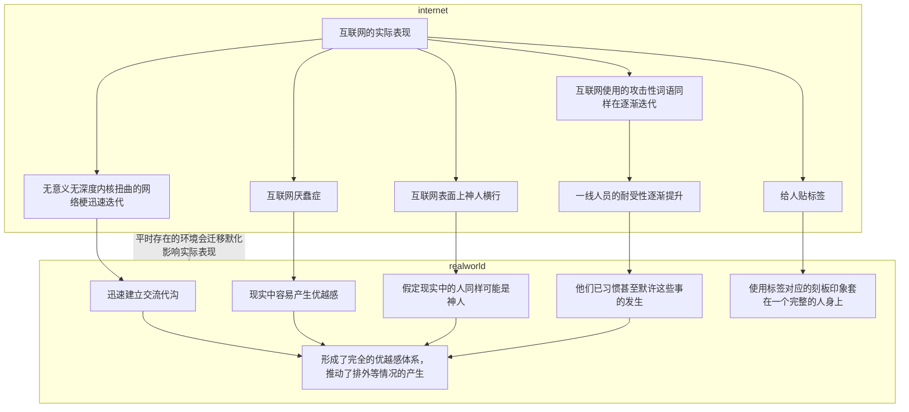

# 2025-08-19

>最后更新：2025-08-20 05:42

无main日+无眠日
鬼混()大于一切
五个小时，推理出了一套完整的逻辑链条
就仅保留仍旧记忆的部分

```mermaid
flowchart TB

subgraph internet
互联网的实际表现-->无意义无深度内核扭曲的网络梗迅速迭代
互联网的实际表现-->互联网厌蠢症
互联网的实际表现-->互联网表面上神人横行
互联网的实际表现-->互联网使用的攻击性词语同样在逐渐迭代-->一线人员的耐受性逐渐提升
互联网的实际表现-->给人贴标签
end

internet--平时存在的环境会迁移默化影响实际表现-->realworld

subgraph realworld
无意义无深度内核扭曲的网络梗迅速迭代-->迅速建立交流代沟-->a
互联网厌蠢症-->现实中容易产生优越感-->a
互联网表面上神人横行-->假定现实中的人同样可能是神人-->a
一线人员的耐受性逐渐提升-->他们已习惯甚至默许这些事的发生-->a[形成了完全的优越感体系，推动了排外等情况的产生]
给人贴标签-->使用标签对应的刻板印象套在一个完整的人身上
end
```

如此等等
最终的结论为:社会属于又一个循环中的下坡路，周围人缺少爱，共情，耐心，创造性
我们能做的只有活好当下，然后静等这一切再次转换
对周围人好一些吧，少用网络梗，把自己和身边人救回来
