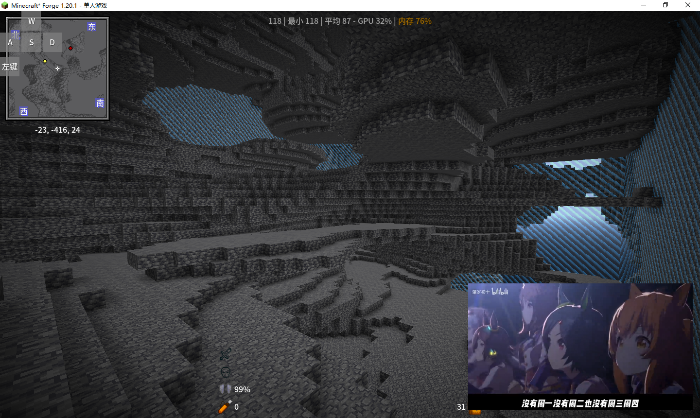

# 洞穴世界的噪声设置

>最后更新：2025-04-29 01:15

- 元胞的水平宽度:2(8)
- 元胞的垂直宽度:4(16)
- 初始地表高度:1(永远大于25/64)
- 最终密度:`fish:cave_world/final_density`
- 含水层，矿脉相关:0
- 生物群系部分
  - 生物群系的温度噪声:0
  - 生物群系的湿度噪声:0
  - 生物群系的大陆性噪声:0
  - 生物群系的侵蚀噪声:0
  - 生物群系的深度噪声:0
  - 生物群系的奇异噪声:0

## 最终密度

- 边界判断:在靠近世界顶端20格与底端20格使其趋近于0

  - ```python
    if(0<y<-20):
        return gradient(y)+15/128
    elif (-492<y<-512):
        return gradient(y)+15/128
    else:
        return noise
    # a if condition else b=b+ condition*(a-b)
    ```

  - (钳制并映射y(-20,0,1,0)\*钳制并映射y(-492,-512,1,0)\*(其他噪声-0.1171875))+(+0.1171875),(0.1171875=15/128)

### 地貌



## 地表规则

- 边界判断:在天花板5格与地底五格渐变添加基岩平台
