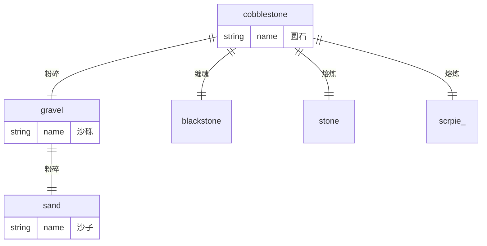

# CAE

```mermaid
erDiagram
    cobblestone ||--|| gravel:"粉碎"
    cobblestone ||--|| blackstone:"缠魂"
    cobblestone ||--|| stone:"熔炼"
    cobblestone ||--|| scrpie_:"熔炼"

    gravel ||--|| sand:"粉碎"


    cobblestone{
        string name "圆石"
    }
    gravel{
        string name "沙砾"
    }
    sand{
        string name "沙子"
    }
```
