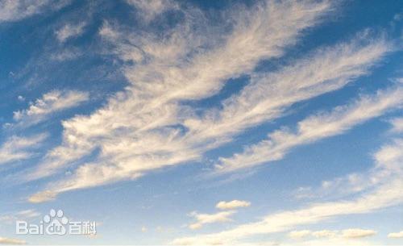

# 随机探索

>最后更新：2025-05-04 01:58

## 云

### 云的强度

云的强度以云量（云遮蔽天空的成数，分总云量和低云量）多少为度量单位，分为三个等级：天空无云或虽有零星云层但云量小于天空面积的十分之一，为晴；有4-7成的中、低云或者有6-10成的高云，为多云；中、低云总云量有8成以上，为阴。

### 云的形态

| 高度                    | 属         | 类                   |
| ----------------------- | ---------- | -------------------- |
| 低云(距离地面0.1-2.5km) | 积云(Cu)   | 淡积云(Cu hum)       |
| 低云                    | 积云       | 碎积云(Fc)           |
| 低云                    | 积云       | 浓积云(Cu cong)      |
| 低云                    | 积雨云(Cb) | 秃积雨云(Cb calv)    |
| 低云                    | 积雨云     | 鬃积雨云(Cb cap)     |
| 低云                    | 层积云(Sc) | 透光层积云(Sc tra)   |
| 低云                    | 层积云     | 蔽光层积云(Sc op)    |
| 低云                    | 层积云     | 积云性层积云(Sc cug) |
| 低云                    | 层积云     | 堡状层积云(Sc cast)  |
| 低云                    | 层积云     | 英状层积云(Sc lent)  |
| 低云                    | 层云(St)   | 层云(St)             |
| 低云                    | 层云       | 碎层云(Fs)           |
| 低云                    | 雨层云(Ns) | 雨层云(Ns)           |
| 中云(2.5-4.5km)         | 高层云(As) | 透光高层云(As tra)   |
| 中云                    | 高层云     | 蔽光高层云(As op)    |
| 中云                    | 高积云(Ac) | 透光高积云(Ac tra)   |
| 中云                    | 高积云     | 蔽光高积云(Ac op)    |
| 中云                    | 高积云     | 荚状高积云(Ac lent)  |
| 中云                    | 高积云     | 积云性高积云(Ac cug) |
| 中云                    | 高积云     | 絮状高积云(Ac flo)   |
| 中云                    | 高积云     | 堡状高积云(Ac cast)  |
| 高云(4.5km+)            | 卷云(Ci)   | 毛卷云(Ci fil)       |
| 高云                    | 卷云       | 密卷云(Ci dens)      |
| 高云                    | 卷云       | 伪卷云(Ci not)       |
| 高云                    | 卷云       | 钩卷云(Ci unc)       |
| 高云                    | 卷层云(Cs) | 毛卷层云(Cs fil)     |
| 高云                    | 卷层云     | 薄幕卷层云(Cs nebu)  |
| 高云                    | 卷积云(Cc) | 卷积云(Cc)           |

统述：云主要分为**团状**的**积云**, **片状** 的 **层云** , **纤维状** 的 **卷云**

#### 高云族

高云族的云云底高度通常大于6000m(从家到学校距离的三倍),形成于对流层较冷的部分，在这高度的水都会凝固结晶，所以这族的云都是由冰晶体所组成的。高云一般呈纤维状，薄薄的并多数会透明。

- 卷云(Cirrus)：云底一般在4500至10000米。它由高空的细小冰晶组成，且冰晶比较稀疏，故云比较薄而透光良好，色泽洁白并具有冰晶的亮泽
  - 毛卷云(cirrus fibratus),纤细分散的云，呈丝条、羽毛、马尾状
  - 密卷云(cirrus spissatus)
