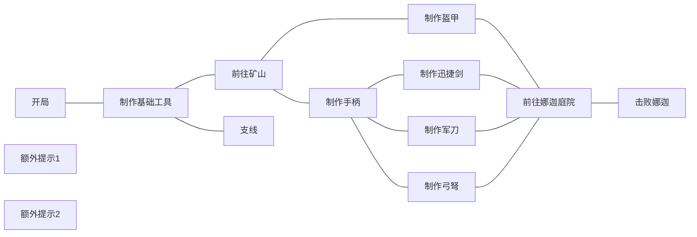

# 未尽之路-第一章体验

>最后更新：2025-09-25 03:57

总结:**第一章的游玩体验十分新鲜和舒适，但一些任务的引导和细节上有所不足，破坏沉浸感**
不过我之前只完整通关过一次原版暮色森林流程，并且并不擅长战斗，可能会有所影响

## 主线

第一章的主线流程节奏很快，你只需要：

1. 找到一片矿山
2. 做出一套钻套和一柄迅捷剑，一面盾牌
3. 分别与娜迦,巫妖两个boss交战

完成这些大概只需要两个小时，包括适应玩法，但不算跑图时间
如果让我再游玩一遍的话，或许半个小时就足够杀穿两只boss了

两个boss的数值基本平衡，装备不足难以打过，在有合适装备的情况下就不算什么难事，而在部分装备合适的情况下同样富有挑战性
战斗的过程不会过于轻松或过于折磨，足以让人留下好印象

反而是矿山内的战斗强度明显大于boss, _囚禁笼中的魂灵_ 伤害极高，足以一下秒掉身穿钻套的僵尸，一旦你没有在挖掉刷怪笼时立马击杀，它们就会四散飞去，悬在头顶随时等待进攻， _红帽_ 时不时会带着令人掉san的声音在你背后咬你一口，各种甲虫会让你的武器难以施展  
不过总的来说我并不会讨厌矿山内的经历，一方面是我还能勉强应付，或是依靠死亡不掉落和它们硬拖，另一方面是矿山内的物资足够我付出这些代价，囚禁笼中的魂灵能掉落各种稀有资源，矿山内更是钻石成群，只需稍加小心就能带着足够的装备迎战boss

## 关于支线

### 墓园

墓园支线相比主线，就有设计欠缺的地方了  
首先，墓园支线只出现在幽魂森林群系中，而该群系的生成密度低到我在小地图传送了十几分钟后不得不祭出locate biome指令，但还是没找到吊死鬼的树
该群系生成密度低，规模又极小，导致一片群系中基本只有1-2个结构
而该支线需要探索多个结构才能完成
且发展该支线没见到任何的明显提升，即使在后续任务中发现有用到，但在发展该支线时我几乎没有得到任何快感
并且我在墓地的箱子里翻到过两台拆解台，bug级的物品肯定不应该被放出来

>剩下的支线还没体验，明天补上

## 引导问题

玩下来引导问题并不算特别严重，至少已经超过平均线了

有些任务的命令奖励有些问题，稍加弥补就能解决
一些小剧情的触发只有一个突然出现的大标题，显得有些突兀，最好变成多句话的形式，或是多交代一些背景故事或提醒玩家一些注意事项

但更多的是整合包对玩家的有效指引被夹杂在大量的无关元素中  
毕竟玩家和作者不是同一套脑子，有时候不能顺利联想到两点之间的关系  

比如从开局到击败娜迦，从结果反推:

其中最需指引的就是`前往矿山获得矿物`和`制作什么装备`,`如何击败娜迦`
再重新整理一遍

大致应当是这个顺序(其中更重要的更靠近屏幕中间，关联更强的距离越近)  
但这章的任务将制作工作台，木镐，石镐各自分配了一个任务，还将钻甲的任务放在更加下方，这样正常的游玩路径在任务里反而是一个大圈

对于有用提示，像`做床更改重生点避免每次复活自由落体`和`制作盾牌`，最好隐藏依赖线，作为单独的任务，而不是可有可无的`附属任务`

另一点是无关文本太多了，有用文本少了
作为指引，就不能当谜语人，也不要讲废话
指引过少的部分:

- 制作床，盾牌的用意
- 矿山内部的描述
- 那几把武器的简要介绍
- 打boss的推荐装备和思路
- "灵魂故乡"任务对应了哪种群系

指引过多的部分

- 开局至石质装备
- 自定义配方的合成方式，FTB可以设置`任务"禁用jei配方":false`,这样可以直接在任务页面使用jei预览配方
- boss的全部机制(建议再单开一页，把其中最重要的部分提炼出来)
- 许多物品的基础用途都可省略或扩充，重点在于为什么要做它

## 其他问题/建议

部分物品爆率太低  
例如死灵书，掉落符文的概率只有10%，虽然击杀巫妖王给予了一个珍珠，能暂时弥补符文不足的问题，但死灵书本来刷的就少，对于这种相对较少的怪，爆率提到20%或是25%才能有明显的爆率，不然就几乎见不到，更何况1%掉附魔书，而且经过我在创造档的测试，其掉落的附魔书基本都是I级附魔，完全不适宜作为附魔书来源，概率提升到5%或10%，并且使其相当于40级附魔且允许出宝藏附魔(原版末地要塞与钓鱼都是相当于30级附魔且允许出现宝藏）
