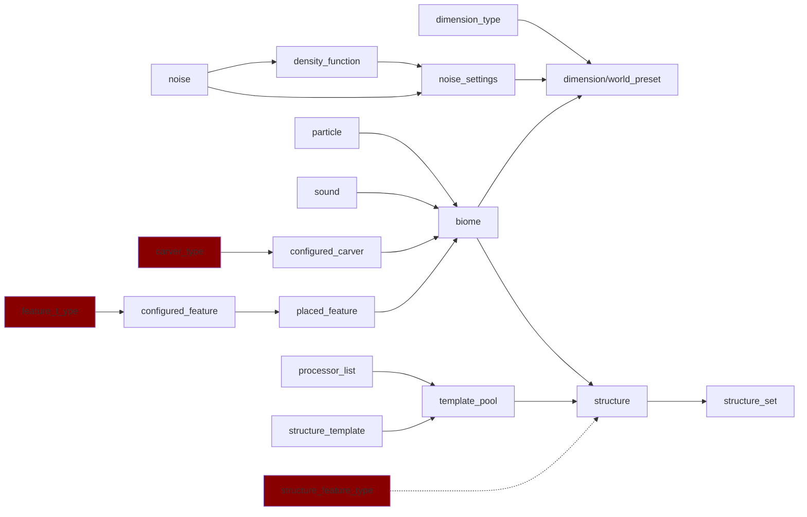

# 关于世界生成的数据包文件 #minecraft #数据包 #使用方法

>最后更新：2025-03-31 19:51

minecraft原版有一套通过数据包json文件控制自定义世界生成的逻辑，
~~但其逻辑特别复杂~~

## 维度类型 Dimension types

维度类型定义了一个维度的基本属性，如坐标缩放，能否使用床等

语法：<https://zh.minecraft.wiki/w/%E7%BB%B4%E5%BA%A6%E7%B1%BB%E5%9E%8B>  
使用：无  
被使用：[维度](#维度世界预设-dimensionworld-preset)

## 维度/世界预设 Dimension/World Preset

世界预设定义了用该预设创建的世界包含哪些维度
维度定义了其使用的类型和生成器

使用：[维度类型](#维度类型-dimension-types),[噪声设置](#噪声设置-noise-settings),[生物群系](#生物群系-biome)
被使用：无

语法：

- 世界预设:  

    ```json
    {
        "dimensions":{
            "维度名称":{
                "type":"维度类型",
                "generator":{
                    "type":"noise",
                    "settings":"噪声设置",
                    "biome_source":{
                        "type":"multi_noise",
                        "biomes":[
                            {
                                "biome":"生物群系",
                                "parameters":{
                                    "temperature":["min","max"],
                                    "humidity":["min","max"],
                                    "continentalness":["min","max"],
                                    "erosion":["min","max"],
                                    "weirdness":["min","max"],
                                    "depth":["min","max"],
                                    "offset":"float"
                                }
                            }
                        ]
                    }
                }
            }
        }
    }
    ```

- 维度:<https://zh.minecraft.wiki/w/%E7%BB%B4%E5%BA%A6%E6%95%B0%E6%8D%AE%E6%A0%BC%E5%BC%8F>

>关于parameters中的内容，可参考<https://zh.minecraft.wiki/w/%E4%B8%96%E7%95%8C%E7%94%9F%E6%88%90#%E7%94%9F%E6%88%90%E7%94%9F%E7%89%A9%E7%BE%A4%E7%B3%BB>

## 噪声设置 Noise settings

噪声设置用于生成地形和噪声洞穴的形状，以及生成地形时使用哪些方块

路径`data/<命名空间>/worldgen/noise_settings/<噪声设置ID>`

语法

```json
{
    "sea_level":"海平面高度",
    "disable_mob_generation":true, //是否禁止普通动物随地形一起生成
    "ore_veins_enabled":false, //是否生成矿脉
    "aquifers_enabled":true, //是否生成含水层和含熔岩层
    "legacy_random_source":false,//是否使用1.18之前的旧的随机数生成器来生成世界
    "default_block":{//该维度地形的默认的方块
        "Name":"minecraft:stone",
        "Properties":{}
    },
    "default_fluid":{//该维度默认的流体，用于生成海洋和湖
        "Name":"minecraft:stone",
        "Properties":{}
    },
    "spawn_target":[
        {
            "temperature":["min","max"],
            "humidity":["min","max"],
            "continentalness":["min","max"],
            "erosion":["min","max"],
            "weirdness":["min","max"],
            "depth":["min","max"],
            "offset":"float"
        }
    ],
    "noise":{
        "min_y":-64,
        "height":384,
        "size_horizontal":0,//取值为0到4的闭区间,代表一个元胞的水平宽度
        "size_vertical":0,//取值为0到4的闭区间,代表一个元胞的垂直宽度
    },
    "noise_router":{//每个字段可以填入一个密度函数ID或一个密度函数（包括常量形式和对象形式）
        "initial_density_without_jaggedness":"密度函数ID",//与含水层和地表规则的生成有关。在一XZ坐标下，从世界顶部开始以size_vertical*4个方块的精度从上到下查找，初次遇到大于25/64的值的高度作为世界生成的初始地表高度。该高度通常应该低于实际的地表高度（由final_density决定）
        "final_density":"密度函数ID", //决定了一个坐标是空气（可以生成含水层）还是世界的默认方块default_block（将会被surface_rule填充）
        "barrier":"密度函数ID",//影响是否使用方块分隔含水层和洞穴其他区域。函数值越大越有可能分隔。
        "fluid_level_floodedness":"密度函数ID", //影响含水层生成液体的概率。函数值越大越有可能生成。该噪声值大于1.0的被视为1.0，小于-1.0的被视为-1.0。
        "fluid_level_spread":"密度函数ID", //影响某处含水层液体表面的高度。函数值越小液体表面越可能较低。
        "lava":"密度函数ID", //影响某处含水层是否使用熔岩代替水。阈值为0.3。
        "vein_toggle":"密度函数ID", //影响矿脉类型和垂直范围。这值大于0.0将是铜矿脉，小于等于0.0将是铁矿脉。
        "vein_ridged":"密度函数ID", //控制哪些方块会参与组成矿脉。如果小于0.0，则方块是矿脉的一部分（是否为矿石块由下方值决定）。
        "vein_gap":"密度函数ID", //影响矿脉中的哪些方块将是矿石块。如果大于-0.3，并且随机数小于从0.4到0.6映射到0.1到0.3的vein_toggle的绝对值，则会放置矿石块，且有2%的概率变为粗金属块。否则，将放置矿脉类型对应的石块。
        "temperature":"密度函数ID", //生物群系的温度噪声。这里和下方的六个值是用于生物群系放置的生物群系参数。某点处生物群系的生物群系参数向量与该点处的对应参数向量的2-范数距离是最小的。
        "vegetation":"密度函数ID", //即humidity，生物群系的湿度噪声。
        "continents":"密度函数ID", //生物群系的大陆性噪声。
        "erosion":"密度函数ID", //生物群系的侵蚀噪声。
        "depth":"密度函数ID", //生物群系的深度噪声。
        "ridges":"密度函数ID", //即weirdness，生物群系的奇异噪声。
    },
    "surface_rule":{"地表规则"}
}
```

地表规则:

```json
{
    "type":"minecraft:badlands"
}

{
    "type":"minecraft:block",
    "result_state":{
        "Name":"minecraft:stone",
        "Properties":{}
    }
}

{
    "type":"minecraft:sequence",
    "sequence":[
        {"地表规则"}
    ]
}

{
    "type":"minecraft:condition",
    "if_true":{"地表规则条件"},
    "then_run":{{"地表规则"}}
}

//地表规则条件

//游戏会使用minecraft:surface噪声决定表层厚度，将（X,0,Z）处的噪声值 × 2.75 + 3.0作为表层厚度，而实际表层厚度还受与坐标相关的随机数的影响上下浮动0.25。该噪声与实际表层厚度在原版的地表规则中配合使用，例如用以决定平原生物群系里泥土和草方块的总厚度。

{
    "type":"minecraft:biome",
    "biome_is":[
        "生物群系ID"
    ]
}
{
    "type":"minecraft:noise_threshold",//此处y=0的噪声值在指定闭区间内成功
    "noise":"噪声ID",
    "min_threshold":"下限",
    "max_threshold":"上限"
}
{
    "type":"minecraft:vertical_gradient",//用作两个岩层间的渐变
    "random_name":"任意命名空间ID作为种子",
    "true_at_and_below":{
        //"absolute":0,  //（三选一）绝对高度。取值为-8176到8175的闭区间。
        //"above_bottom":0,  //（三选一）相对高度，从世界底部开始。取值为-8176到8175的闭区间。
        //"below_top":0,  //（三选一）相对高度，从世界顶部开始。值越高则高度越低。取值为-8176到8175的闭区间。
    },
    "false_at_and_above":{
        //"absolute":0,  //（三选一）绝对高度。取值为-8176到8175的闭区间。
        //"above_bottom":0,  //（三选一）相对高度，从世界底部开始。取值为-8176到8175的闭区间。
        //"below_top":0,  //（三选一）相对高度，从世界顶部开始。值越高则高度越低。取值为-8176到8175的闭区间。
    }
    //位于两坐标之间的部分产生渐变，在此区间成功的概率为(false_at_and_above - Y) / (false_at_and_above - true_at_and_below)
}
{
    "type":"minecraft:y_above",//if(y>=anchor)return true;
    "anchor":{
        //"absolute":0,  //（三选一）绝对高度。取值为-8176到8175的闭区间。
        //"above_bottom":0,  //（三选一）相对高度，从世界底部开始。取值为-8176到8175的闭区间。
        //"below_top":0,  //（三选一）相对高度，从世界顶部开始。值越高则高度越低。取值为-8176到8175的闭区间。
    },
    "surface_depth_multiplier":0,//取值为-20到20的闭区间。表示受表层厚度的影响程度，条件成功的最小Y坐标会在anchor值的基础上加上表层厚度 × surface_depth_multiplier格。
    "add_stone_depth":false //不检测当前的方块坐标，而是检测当前方块的Y坐标加上“该Y平面与正上方空气方块之间的非液体方块的数量”后的值。例如Y=2处为空气，Y=1处为水，Y=0处为石头，在该石头处应用此条件，则该Y平面（此时为Y=0平面）与正上方空气方块（此时为Y=2的空气）之间的非液体方块的数量为1（即坐标为Y=0的这个石头）。
}

{
    "type":"minecraft:water",//（检查当前位置相对于上方液面（指空气与液体接触面）的高度（总为小于等于-2的负值）是否大于指定值。若与上方最近空气方块之间没有液体，则永远成功。例如上方与空气间只隔了一层液体，则当前位置相对于上方液面的高度为-2）
    "offset":0,//相对于上方液面（指空气与液体接触面）的相对高度。如果设为大于-1的值，则只有当与上方最近空气方块之间没有液体时条件成功。如果设为-1，在地形生成时与大于-1的值效果一样，在雕刻器生成时永远成功。
    "surface_depth_multiplier":0,//取值为-20到20的闭区间。表示受表层厚度的影响程度，条件成功的最小Y坐标会在anchor值的基础上加上表层厚度 × surface_depth_multiplier格。
    "add_stone_depth":false //不检测当前的方块坐标，而是检测当前方块的Y坐标加上“该Y平面与正上方空气方块之间的非液体方块的数量”后的值。例如Y=2处为空气，Y=1处为水，Y=0处为石头，在该石头处应用此条件，则该Y平面（此时为Y=0平面）与正上方空气方块（此时为Y=2的空气）之间的非液体方块的数量为1（即坐标为Y=0的这个石头）。
}
{
    "type":"minecraft:temperature",//（检查此处的随高度调整的温度是否足够低以可以下雪。随高度调整的温度取决于生物群系的temperature和temperature_modifier字段以及当前的Y轴坐标）
}
{
    "type":"minecraft:steep",//检查此处是否为背阳（朝向北或朝东）且高度差大于4格的陡峭斜坡
}
{
    "type":"minecraft:not",
    "invert":{"地表规则条件"}
}
{
    "type":"minecraft:hole",//检查表层厚度是否小于0
}
{
    "type":"minecraft:above_preliminary_surface",//是否高于预处理地表，预处理地表高度为由initial_density_without_jaggedness产生的地表高度插值后，向下偏移8格，再加上表层厚度后的值
}
{
    "type":"minecraft:stone_depth",//检测当前位置与地表或洞穴表面的距离是否小于等于指定距离
    "offset":0,//指定的距离
    "add_surface_depth":false,//是否受表层厚度的影响。若是，条件成功的最大距离为offset值加上表层厚度
    "secondary_depth_range":0,//表示受表层厚度附加噪声"minecraft:surface_secondary"影响的程度。条件成功的最大距离为offset值加上secondary_depth_range × 噪声值格
    "surface_type":"floor"//可以是floor或ceiling。如果是ceiling，检测与下方洞穴上表面的距离（实际上就是检测到正下方最近的液体或空气方块的距离），例如Y=-1处为水，Y=0处为石头，在该石头处应用此条件，则到正下方最近的液体或空气方块（此时为Y=-1的液体）的距离为0。如果是floor，检测与地表或者上方洞穴下表面的距离（实际上是检测该方块正上方与空气方块之间的非液体方块的数量，若中间存在液体该值可能会小于与地表或者上方洞穴下表面的实际距离），例如Y=2处为空气，Y=1处为水，Y=0处为石头，在该石头处应用此条件，该方块正上方与空气方块（此时为Y=2的空气）之间的非液体方块的数量为0。
}

```

使用：[密度函数](#密度函数-density-function),[噪声](#噪声-noise)
被使用：[维度](#维度世界预设-dimensionworld-preset)

## 生物群系 Biome

生物群系（Biome）是在维度里划分出的区域，具有独特的地物、雕刻器、气候、生成的生物、环境音效、音乐以及天空、水、草地和树叶的颜色

路径:`data/<命名空间>/worldgen/biome/<生物群系ID>`

语法：

```json
{
    "has_precipitation":true,//该生物群系是否拥有降水
    "temperature": 0.5,//控制草和树叶等地物的颜色（见生物群系 § 着色），以及计算随高度调整的温度值（下雨还是下雪，以及某些地物的生成细节）
    "temperature_modifier":"none",//（可选，默认为none）在计算随高度调整的温度值之前对初始温度值进行随机修改。可以为none（不修改）或frozen（调高某些区域的温度值以使其足以下雨（0.2））
    "downfall": 0.5,//控制草和树叶等地物的颜色
    "effects": {//该生物群系的环境效果
        "fog_color": 12638463, //用于迷雾的十六进制转十进制RGB颜色值。
        "sky_color": 8103167, //用于天空的十六进制转十进制RGB颜色值。
        "water_color": 4159204, //用于水的十六进制转十进制RGB颜色值。
        "water_fog_color": 329011, //用于水下迷雾的十六进制转十进制RGB颜色值。
        //"foliage_color":0, //（可选）用于树叶和藤蔓的十六进制转十进制RGB颜色值。默认由单精度浮点数downfall和单精度浮点数temperature决定。
        //"dry_foliage_color":0, //（可选）用于枯叶的十六进制转十进制RGB颜色值。默认由单精度浮点数downfall和单精度浮点数temperature决定。
        //"grass_color":0, //（可选）用于草方块、矮草丛、高草丛、蕨、大型蕨、甘蔗、粉红色花簇的茎的十六进制转十进制RGB颜色值。默认由单精度浮点数downfall和单精度浮点数temperature决定。
        "grass_color_modifier":"none", //（可选，默认为none）可以为none、dark_forest或swamp
        "particle":{//（可选）充斥在该生物群系中的粒子
            "probability":0.0,//粒子产生的频率。高于1的值相当于1，低于0的值相当于0
            "options":{//要使用的粒子
                "type":"minecraft:crimson_spore"//粒子类型ID
                //某粒子选项的子标签
            }
        },
        "ambient_sound":{//（可选）用于环境音效的声音事件
            "range":16.0,//声音事件实例最远可以传播发送给玩家客户端的距离。如果此值不存在，将使用16倍初始音量作为传播距离
            "sound_id":"minecraft:ambient.cave"//此声音事件使用的声音事件引用。对于所有原版定义在固有注册表内的声音事件，此项与声音事件的注册名一致
        },
        "mood_sound": {//（可选）氛围音效(原版洞穴环境音效)所使用的设置
            "block_search_extent": 8,//决定了氛围音效播放位置的正方体范围的大小。此正方体范围以玩家为中心，棱长为2 * block_search_extent
            "offset": 2.0,//值越大，声源距离玩家越远
            "sound": "minecraft:ambient.cave",//要使用的声音事件(此处为不含range值的另一种表达方式)
            "tick_delay": 6000//两次播放间的最小延迟
        },
        "additions_sound":{//（可选）附加音效所使用的设置
            "sound":"minecraft:ambient.cave",//要使用的声音事件
            "tick_chance":0.001//每一游戏刻中开始播放的概率。高于1的值相当于1，低于0的值相当于0
        },
        "music":[//（可选）该生物群系中的音乐。为一个加权列表，如果列表为空则表示不播放音乐
            {
                "weight":1,//选择该音乐的权重
                "data":{//音乐具体数据
                    "sound":"minecraft:music.overworld.forest",//要使用的声音事件
                    "min_delay": 12000,//两次播放间最小延迟
                    "max_delay": 24000,//两次播放间最大延迟
                    "replace_current_music": false,//是否立即替换正在播放的音乐
                }
            }
        ],
        "music_volume":1//（可选，默认为1）音乐的音量，游戏会在切换生物群系时平滑过渡音量。高于1的值相当于1，低于0的值相当于0
    },
    "carvers": {},//（可以为空列表）要使用的地形雕刻器。可以是一个已配置雕刻器ID、一个已配置雕刻器标签、一个已配置雕刻器对象、一个已配置雕刻器ID的列表或一个已配置雕刻器对象的列表。
    "features": [//（可以为空）由至多11个元素组成的列表。每个元素可以是已放置地物ID、已放置地物标签、已放置地物ID的列表或已放置地物对象的列表。列举出的地物按步骤按顺序依次应用于每个区块。两个生物群系中同一步骤中相同已放置地物不能以不同的顺序排列。对于每个步骤，所有地物ID在不同生物群系也需要顺序一致。例如，在minecraft:plains中，UNDERGROUND_ORES步骤，ore_dirt在ore_gravel之前，所以在其他生物群系的UNDERGROUND_ORES步骤中，如果存在ore_dirt和ore_gravel，则ore_dirt不能在ore_gravel之后。生成步骤也用于结构地物。
        [],//内部地物类型RAW_GENERATION（原始生成）。原版中用于小型末地岛屿。
        [],//内部地物类型LAKES（湖）。原版中用于熔岩湖。
        [],//内部地物类型LOCAL_MODIFICATIONS（局部修改）。原版中用于紫晶洞和冰山。
        [],//内部地物类型UNDERGROUND_STRUCTURES（地下结构）。原版中用于主世界的地牢和化石。
        [],//内部地物类型SURFACE_STRUCTURES（地表结构）。原版中用于沙漠水井和蓝冰斑块。
        [],//内部地物类型STRONGHOLDS（要塞）。原版中不用于任何地物。
        [],//内部地物类型UNDERGROUND_ORES（地下矿石）。原版中用于主世界的矿物团簇、主世界的泥土/沙砾/石头变种的团簇，以及湖中生成的沙子/沙砾/黏土的圆盘。
        [],//内部地物类型UNDERGROUND_DECORATION（地下装饰）。原版中用于虫蚀方块的团簇、下界的沙砾团簇、下界的黑石团簇，以及其他所有的下界矿物团簇。
        [],//内部地物类型FLUID_SPRINGS（流体涌泉）。原版中用于水和熔岩的喷泉。
        [],//内部地物类型VEGETAL_DECORATION（植被装饰）。原版中用于树、竹子、仙人掌、海带，以及其他的地表/海底植被。
        []//内部地物类型TOP_LAYER_MODIFICATION（顶层修改）。默认用于地表的冰冻。
    ],
    "creature_spawn_probability":0,//（可选，默认为0，取值为0到0.9999999的闭区间）值越大，世界生成时生成的动物（creature）数量越多。
    "spawners": {//（可以为空。若不包含某一个生物种类，则不生成此类生物）生物生成设置。
        //<生物种类>：（可以为空。若为空，则不生成此类生物）键名可以是monster、creature、ambient、water_creature、underground_water_creature、water_ambient、misc或axolotls。一个生成数据的对象的列表，列表的每一项都对应一种应该在该生物群系生成的生物。
        "ambient": [],
        "axolotls": [],
        "creature": [],
        "misc": [],
        "monster": [
            {
        "type": "minecraft:zombie",//该生物的命名空间ID
        "maxCount": 4,//成群生成时的最高数量。
        "minCount": 4,//成群生成时的最低数量。
        "weight": 95//该生物的生成权重，更高的值代表更多的生成。
            }
        ],
        "underground_water_creature": [],
        "water_ambient": [],
        "water_creature": []
    },
    "spawn_costs": {//（可以为空，只有在此对象中列出的生物才使用生成势机制）生成势。以一套类似于模拟真空中的点电荷系统的机制控制该生物群系内生成生物的数量与密度，详见生成 § 生成势。
        "minecraft:enderman": {//生成的实体
            "charge": 1.0,//此次生成放置的点电荷的电荷量。每次生成都在之前放置的点电荷的基础上试图将一个点电荷从无穷远处移动到目标点，计算电势能并比较以决定是否生成。在宏观意义上看，此值越大生成的越少。
            "energy_budget": 0.12//电势预算。生成此实体时能消耗最大能量。在宏观意义上看，此值越小生成的越少
        }
        //假设在一个空间内有N个具有生成势的生物，每个生物的生成势为a_i，则对于空间内的点P，它的势能E_p=c*∑(a_i/d_i)，其中d_i为点P到对应生物位置的欧几里得距离，c为要生成生物的生成势。以诡异森林的末影人举例，它的生成势为1，那么对其他末影人，以它的中心半径为1的球上势能都为1，半径为2势能为0.5，半径为8势能为0.125，而末影人本身的最大生成势为0.12，即如果一个位置的势能超过0.12那么它就无法生成，所以在诡异森林中末影人在生成时至少会间隔9格。
    },
}
```

>关于声音事件ID，见<https://github.com/misode/mcmeta/blob/assets/assets/minecraft/sounds.json>

## 密度函数 Density function

用于根据一定算法将一个方块坐标转换为一个数

可用运算：

- 新运算
  - 加(减)
  - 乘
  - 最大/最小值
  - 函数:$f \in[a,b)?c:d$
  - 常数
  - 绝对值
- 组合运算
  - 平方
  - 立方
  - 钳制
  - 钳制并映射Y
  - 如果输入的密度函数的值大于零，则返回该值本身；否则返回该值的一半or1/4。
  - 把输入值钳制在-1到1的区间内（小于-1的视为-1，大于1的视为1），然后将它代入公式x/2 - x*x*x/24并返回。
- 硬编码
  - 新旧版本过渡
  - 末地外岛
- 特殊
  - 插值
  - 缓存
  - 噪声采样

>纯数学能力总结:A,a+b,a*b,abs(a),min(a,b),max(a,b),$f \in[A,B)?c:d$

语法:

```json

```

使用：[噪声](#噪声-noise)
被使用：[噪声设置](#噪声设置-noise-settings)

## 噪声 Noise

多个频率叠加的simplex噪声，被噪声设置和密度函数所引用

使用：无
被使用：[密度函数](#密度函数-density-function),[噪声设置](#噪声设置-noise-settings)

>关于柏林噪声，见
>关于其所对应的取值，见

## 总览



## 画廊
