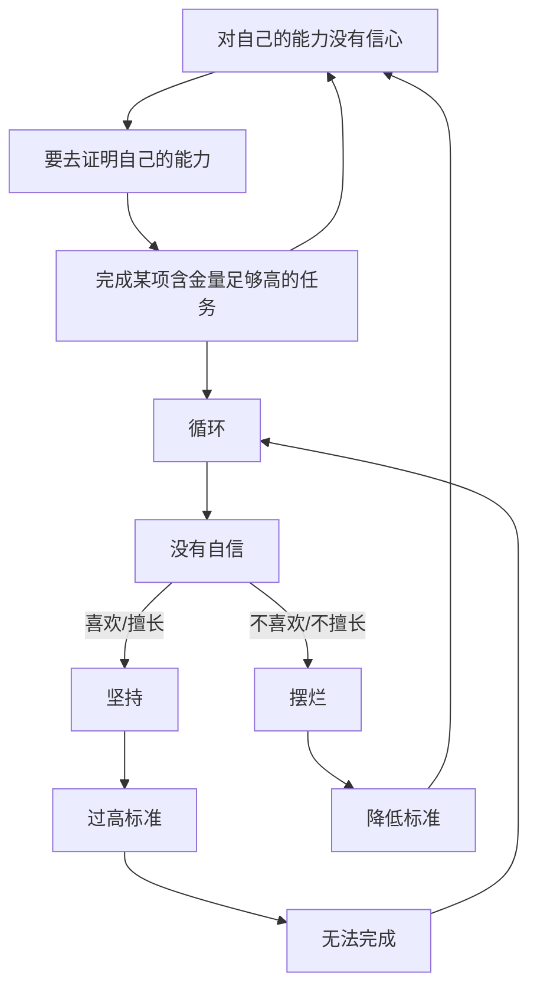

#

>最后更新：2025-03-20 02:52

```mermaid
graph 
对自己的能力没有信心 -->  
要去证明自己的能力 -->  
完成某项含金量足够高的任务 -->  对自己的能力没有信心

完成某项含金量足够高的任务 --> 循环
循环 --> 没有自信
没有自信 -->|喜欢/擅长| 坚持 --> 过高标准
没有自信 -->|不喜欢/不擅长| 摆烂 --> 降低标准

过高标准 --> 无法完成 --> 循环
降低标准 --> 对自己的能力没有信心
```
